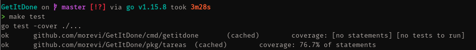

# GetItDone


## Descripción.
El objetivo es crear una API que permita gestionar, mediante operaciones CRUD, listas de tareas por etiquetas, y deadlines. De forma que puedas estar siempre organizado y productivo. Se podrá levantar en un servidor, actuar de microservicio, y ser utilizada desde otras aplicaciones.

## TESTS
### Herramientas de construcción y tests
- Construcción: `make`, es una herramienta flexible, independiente del lenguaje, permitirá simplificar las operaciones de construcción y mantenimiento del proyecto. Aunque `Go` viene con su propia herramienta de construcción, el uso de un Makefile permitirá simplificar los comandos, y reducirá nuestra carga al realizar operaciones de este tipo.
- Test: El propio lenguaje `Go` aunque también es posible utilizar paquetes externos, incluye su propio entorno test. Vamos a utilizar este marco, ya que además de estar perfectamente integrado con el entorno de `go` (*go test*), ofrece algunas caracteríscicas bastante interesantes, como: 
  
  - La opción `-cover`, para generar un pequeño reporte donde podremos ver el porcentaje de código cubierto por los tests.
  
  - La opción `-c` para generar un ejecutable a partir de lost tests.
  
  - La ejecución de tests en parciales.
  
  - Paralelismo en la ejecución de tests.
  
  Para ejecutarlos hace falta crear un fichero *_test.go*, y luego realizar *go test* en el directorio con los ficheros *.go*. Los ficheros test deben estar en el mismo directorio que el fichero al que testean.


### Construcción 

Necesitas tener `go`, `make`, y `git`instalados para poder compilar el proyecto.
No es necesaria ninguna otra dependencia, `go` se encargará de traer las todo que necesite usando `git`.
Puedes ver el código del [Makefile](Makefile).

Para ejecutar el programa sin compilar, puedes utilizar el siguiente comando:

```
make run
```
Pará obtener un ejecutable e instalarlo donde quieras:

```
make build
```
Si tienes $GOPATH en tu $PATH, puedes instalar directamente el binario con:
```
make install
```
##### Makefile
Este es la implementación del [Makefile](Makefile):

```makefile
# Generar un ejecutable
build:
		go build -o getitdone cmd/getitdone/main.go

# Generar un ejecutable e instalarlo en 
install:
		go install ./...

# Ejecutar el programa sin generar ejecutable
run:
		go run cmd/getitdone/main.go

# Lanzar todos los tests
test:
		go test -cover ./...

# Compilar los tests por paquetes
build-test:
		go test -c -cover ./cmd/getitdone
		go test -c -cover ./pkg/tareas

```


### Ejecución de tests

Para ejecutar todos los tests usamos:
```
make test
```
Este comando ejecutará los tests de las clases *Project* y *Task*.

También se pueden compilar los tests y ejecutarlos como programas independientes:
```
make build-test
./GetItDone.test
./tareas.test
```



### Clases a testear

#### Tarea/Task

[Task](pkg/tareas/task.go)
[Task tests](pkg/tareas/task_test.go)
Representa una tarea o *todo*, incluye una descripción, una fecha límite para completarla y un estado (completada o no). Su implementación es un paso adelante en la HU05 y la HU06.

#### Proyecto/Project

[Project](pkg/tareas/project.go)
[Project tests](pkg/tareas/project_test.go)
Representa una colección de tareas, incluye tags para organizarlos, una descripción y la serie de tareas que se le asignen. Es un paso hacia HU01, HU02 y HU04. 

#### Dashboard

[Dashboard](pkg/tareas/dashboard.go)
[Dashboard tests](pkg/tareas/dashboard_tests.go) (working on it)
Representa el conjunto de los proyectos. Nos permitirá realizar búsquedas sobre los proyectos de forma más simplificada. Su implementación supone un avance hacia HU03 y HU04 


## Pasos a realizar.

 - Acabar la clase `Dashboard` desde la que gestionar los proyectos y sus tareas
 - Terminar una historia de usuario.
 - Seguir documentando issues. 
 - Acabar [Tercer milestone](https://github.com/morevi/GetItDone/milestone/4).


## Pasos realizados.

Puedes leer sobre ellos [aquí](docs/pasos.md).


## Más información.

 - [¿Por qué este proyecto?](docs/why.md)
 - [Historias de usuario](docs/hu.md)
 - [Clases](docs/classes.md)
 - [Taskfile y builds](docs/builds.md)
 - [Tests](docs/tests.md)
 - [El problema a resolver](docs/problemDescription.md)
 - [Configuración de `git`](docs/git.md)
 - [Herramientas](docs/tools.md)

## Autor.
Francisco José Moreno Vílchez [@morevi](https://github.com/morevi)

