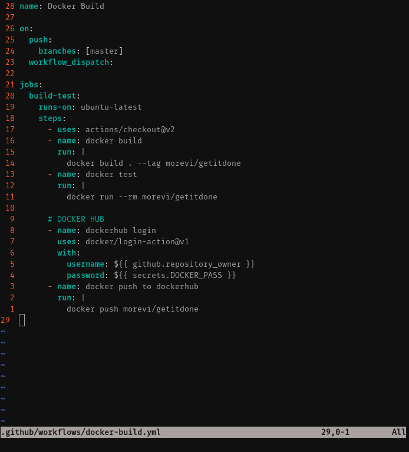
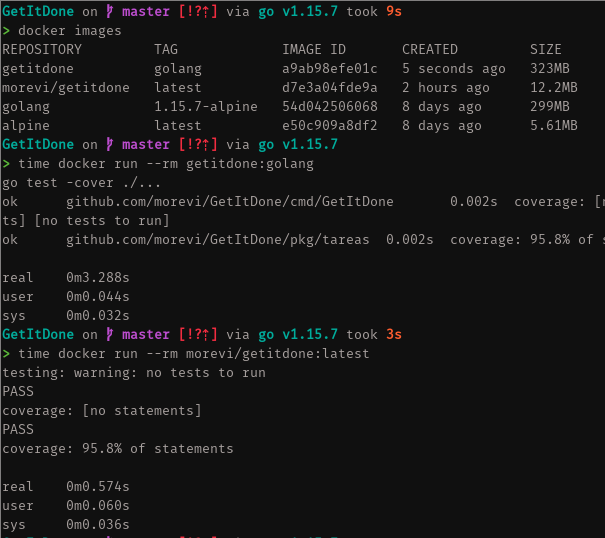

# GetItDone


## Descripción.
El objetivo es crear una API que permita gestionar, mediante operaciones CRUD, listas de tareas por etiquetas, y deadlines. De forma que puedas estar siempre organizado y productivo. Se podrá levantar en un servidor y pueda actuar de microservicio, y pueda ser utilizada desde otras aplicaciones.

## DOCKER
Para facilitar la automatización de los tests, se va a crear una imagen de docker, de forma que se pueda lanzar tanto en local como en diferentes servicios y que el resultado sea siempre el mismo.

### Contenedor base.
En la mayoría de casos, una imagen oficial de un lenguaje, `golang`,será más eficiente en cuanto a velocidad como en peso que una imagen de uso genérico como podría ser la de `ubuntu` con *go* instalado. 

Por tanto, vamos a centrarnos en las imágenes oficiales de `golang`. La más reducida en tamaño podemos ver que son las basadas en Alpine, una distribución Linux que busca tener un tamaño mínimo. Para empezar a trabajar, esta será nuestra mejor opción.

### El dockerfile.
Resumidamente, se compilarán los tests en una imagen de `golang`, y luego se copiarán los binarios en una imagen `alpine`
```
# Usamos una imagen optimizada de go sobre alpine para que sea lo más ligera
# posible durante la compilacion.
FROM golang:1.15.7-alpine AS build
WORKDIR /test
COPY . .

# Reutilizamos un unico RUN para evitar la creación de layers
# Ademas, usamos --no-cache para que no se guarde la caché del manejador de paquetes. Aunque igualmente, al ser una máquina de construcción, no afectará a la máquina final.
RUN \
  apk update && apk add --no-cache git make \
  && make build-test

# Usamos una imagen mucho más ligera, alpine, para copiar los ejecutables en ella.
# De esta forma será más rápido trabajar con ella, compartirla o subirla a las diferentes plataformas
FROM alpine
WORKDIR /test
COPY --from=build /test .
CMD ./GetItDone.test && ./tareas.test
```
### Automatización y Docker Hub.
Se ha creado [.github/workflows/docker-build.yml](.github/workflows/docker-build.yml), de forma que utilizaremos `github actions` para automátizar la construcción, testeo del proyecto y subida a Docker Hub.


Este workflow se ejecutará en cualquier tipo de push (o pull).
Las tareas se realizaran secuencialmente sobre la misma instancia de *ubuntu-latest*.

Básicamente se realiza:
1. Se sitúa sobre el proyecto y realiza el build.
2. Luego ejecuta los test.
3. Posteriormente realiza login en DockerHub usando las credenciales ofrecidas por github (username) o en secretos (password).
4. Procede a publicar en DockerHub la imagen.

Si cualquier paso da lugar a fallo, se indicará error tanto en el action como en el badge al inicio del README.md

### Optimización de la imagen.
He optado por 3 medidas para reducir el tamaño de la imagen final que se publicará en DockerHub:
- Uso de pocas directivas `COPY` y `RUN`:
Cada aparición de estas genera una nueva capa o 'layer' que docker utiliza para optimizar la construcción de futuras imágenes. Pero a cambio se incrementa es espacio que utilizan. Por tanto, reutilizaremos estas sentencias mediante el uso de *&&*.
- Uso de `--no-cache`:
Los 'package manager' utilizan una caché, para optimizar futuras instalaciones de paquetes. Como nuestra imagen no requiere a priori es autocontenida, y no requiere de más paquetes (aunque podría usarse de imagen base para otra imagen), esta opción nos va permitir ahorrar más MB.
- Uso de *multi-stage* builds:
Docker incluye una funcionalidad que permite usar una imagen, para generar otra. Es decir, podemos, en nuestro caso, usar la imagen de `golang:alpine` (300MB aproximadamente) para compilar nuestra API o los tests, y luego, copiar los binarios en una máquina mucho más ligera como `alpine:latest` (10MB aprox.). Esto permite tener una imágen extraordinariamente pequeña, perfecta para ser utilizada en producción, o en nuestro caso, para poder compartirla, subirla y descargarla rapidamente desde DockerHub.

#### Comparación
Solo compararé las imágenes más eficientes.

| Base          | Optimización | Tamaño | Tiempo |
| ------------- | ------------- | ------------ | ------------ |
| Golang:alpine  | Pocas capas + --no-cache | 323 MB | 3.25 segundos |
| Golang -> alpine| Pocas capas + --no-cache + multi-stage | 12.2 MB | 0.66 segundos |



## Construcción
Necesitas tener `go`, `make`, y `git` instalados para poder compilar el proyecto.
No es necesaria ninguna otra dependencia, `go` se encargará de traer las todo que necesite.

Para ejecutar el programa sin compilar, puedes utilizar el siguiente comando:
```
make run
```

Pará obtener un ejecutable e instalarlo donde quieras:
```
make build
```

Si tienes $GOPATH en tu $PATH, puedes instalar directamente el binario con:
```
make install
```

[Aqui](docs/tools.md) puedes leer porqué hemos elegido `make`.

## Tests
Para ejecutar todos los tests usamos:
```
make test
```
Este comando ejecutará los tests de las clases *Project* y *Task*.

También se pueden compilar los tests y ejecutarlos como programas independientes:
```
make build-test
./GetItDone.test
./tareas.test
```

Puedes leer más sobre el entorno de tests [aquí](docs/tools.md).

## Historias de usuario
Se ha creado la etiqueta `user-stories` para poder visualizarlas de forma sencilla en la ventana de issues.

Cada issue del tipo `user-stories`, contiene un título conciso, y una frase de historia de usuario en la descripción de la misma.

Aquí enlaces a cada una de las historias de usuario:
 - [HU01](https://github.com/morevi/GetItDone/issues/1) Información de las proyectos.
 - [HU02](https://github.com/morevi/GetItDone/issues/2) Gestión de proyectos.
 - [HU03](https://github.com/morevi/GetItDone/issues/3) Búsqueda y organización de proyectos.
 - [HU04](https://github.com/morevi/GetItDone/issues/4) Visualización del proyecto.
 - [HU05](https://github.com/morevi/GetItDone/issues/19) Información de la tarea.
 - [HU06](https://github.com/morevi/GetItDone/issues/5) Gestión de tareas.

## Clases.
### 
Representa una tarea o *todo*, incluye una descripción, una fecha límite para completarla y un estado (completada o no). Su implementación es un paso adelante en la HU05 y la HU06.

### 
Representa una colección de tareas, incluye tags para organizarlos, una descripción y la serie de tareas que se le asignen. Es un paso hacia HU01, HU02 y HU04.

## Pasos a realizar.
 - Elegir un contenedor base para las pruebas.
 - Crear un dockerfile
 - Crear una clase `escritorio` desde la que gestionar los proyectos y sus tareas
 - Terminar una historia de usuario.
 - Seguir documentando issues. [Tercer milestone](https://github.com/morevi/GetItDone/milestone/3).

## Pasos realizados.
Puedes leer sobre ellos .

## Más información.
 - [¿Por qué este proyecto?](docs/why.md)
 - [El problema a resolver](docs/problemDescription.md)
 - [Configuración de `git`](docs/git.md)
 - [Herramientas](docs/tools.md)

## Autor.
Francisco José Moreno Vílchez [@morevi](https://github.com/morevi)

