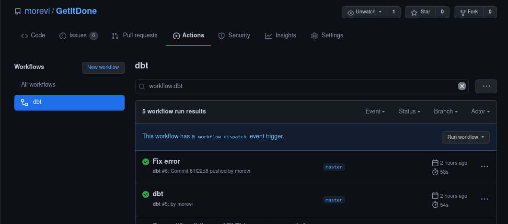
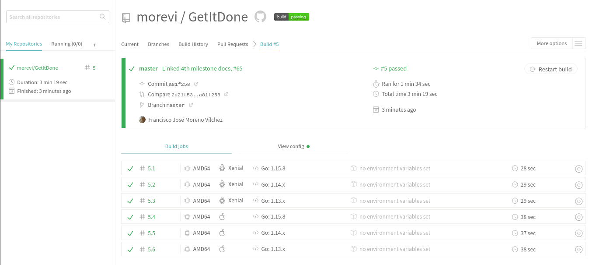
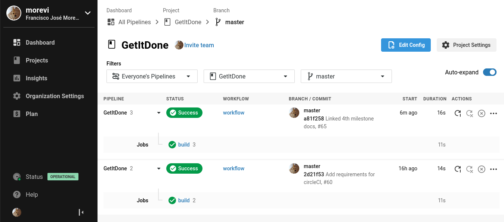

# Integración continua.

## Actions


## CI funcionando y correcta justificacion (travis) 3pto



## Configuracion de otro sistema de ci. 2pto



## Uso del gestor de tareas
Se han añadido entradas al [Makefile](../Makefile) para trabajar con docker de forma más sencilla al ejecutar más facilmente los comandos más recurrentes, permitiendonos utilizar siempre el Taskfile.

```
docker-test:
		docker run -t -v `pwd`:/test morevi/getitdone:latest

docker-build:
		docker build . --tag morevi/getitdone:latest

docker-push:
		docker push morevi/getitdone:latest
```

Tambien se simplifican los ficheros de configuración de integracion continua, al usar estas sentencias reducidas en lugar de la version original.

Y en caso de querer hacer un cambio, solo es necesario editar este fichero!

## Aprovechamiento del docker

## Avance del proyecto

